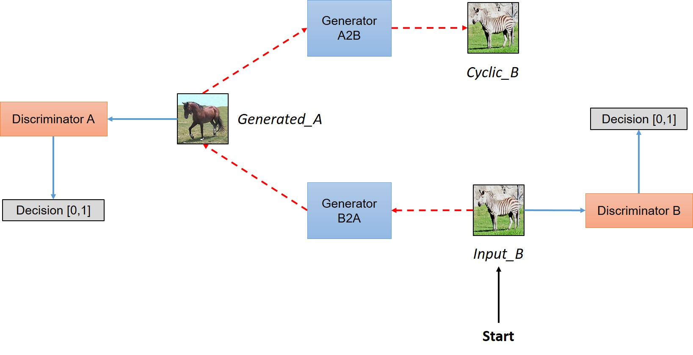

# We are all Monets

## Team Members
+ Sadie Zhao
+ Adeena Liang
+ Irmak Bukey
+ Olina Wong

## Introduction
Writers have their unique prose, musicians have their unique vibe, and no differently, artists have their own unique style that are recognisable in their works throughout their lives. With the development of generative adversarial networks, we can utilise neural networks to imitate any particular style of a specific artist. 

With this project, we wish to be able to replicate the style of Monet given any image. People have well-studied the typical image-to-image translation problem, where the goal is to learn the mapping between an input image and an output image using a training set of aligned image pairs. However, for many tasks, paired training data will not be available. In this project, for example, we are given Monet's paintings as our training data set, while paired training data are unavailable. Thus, we wish to achieve our goal through a recently developed architecture named Cycle-Consistent Adversarial Networks (CycleGANs), which is developed on the base of traditional GANs and aimed at solving unpaired image to image translation problem. 

## Project Goals

1. Explore methods for cleaning the training and test data sets
2. Learn and understand generative adversarial networks (GANs) and Cycle-Consistent Adversarial Networks (CycleGANs)
3. Train a neural network that is able to transfer any image to Monet style
4. Improve the performance of the neural network

## Literature Review
[Generative Adversarial Networks](https://arxiv.org/pdf/1406.2661.pdf) proposes a new framework for estimating generative models via an adversarial process. The authors introduce a generative and a discriminative model to capture the data distribution and estimate the probability that a sample came from the training data respectively. The framework introduced corresponds to a “minimax two-player game”.

In [Unpaired Image-to-Image Translation using Cycle-Consistent Adversarial Networks](https://arxiv.org/pdf/1703.10593.pdf), an approach for learning to translate an image in the absence of paired examples is introduced. The mapping from a source domain to target domain is strengthened by an inverse mapping from target to source and the introduction of a cycle consistency loss. The approach is applied to various image-to-image translation tasks and shows promising results.

To gain insight on a more general application of conditional adversarial networks, we considered [Image-to-Image Translation with Conditional Adversarial Networks](https://arxiv.org/pdf/1611.07004.pdf) which explored conditional adversarial networks as a “general-purpose solution to image-to-image translation problems” due to its ability to learn a loss function to train the given mapping. The authors emphasize the redundancy of “hand-engineered loss functions” as a result of using this approach and demonstrate its effectiveness when applied to a variety of tasks.

[Image-to-Image Translation: Methods and Applications](https://arxiv.org/pdf/2101.08629.pdf) provides an overview of the image-to-image works developed in recent years. The authors draw attention to some of the key techniques developed in the field and discuss the effects of image-to-image translation on the research and industry community.

## Methods
### Dataset and Model Brief
In this project, we plan to use [Tensorflow](https://www.tensorflow.org/overview) and base our experiment on both [Kaggle](https://www.kaggle.com/code/sadiezhao/cs152-project-we-are-all-monet) notebook (with TPU V3-8 as an accelerator) and [Google Colab](https://colab.research.google.com/drive/1T4toYtvzIO9qrv5ADEuP1bMjeeMviAhT?usp=sharing) (with GPU as an accelerator), which allow us to compare and evaluate the runtime performance of our project. We ran the smae code on both platforms mainly because Kaggle Notebooks requires user to queue for TPU (sometimes people need to queue for 1-2 hours to acess the TPU). Therefore, we wish to also ran our experiment on other platforms, and in the meantime, see how our model perform without TPU. 

Our dataset, provided by Kaggle, consists of four parts:
1. _monet_jpg_ - 300 Monet paintings sized 256x256 in JPEG format
2. _monet_tfrec_ - 300 Monet paintings sized 256x256 in TFRecord format
3. _photo_jpg_ - 7028 photos sized 256x256 in JPEG format
4. _photo_tfrec_ - 7028 photos sized 256x256 in TFRecord format

The _monet_tfrec_ and _monet_jpg_ directories contain the same painting images, and the _photo_tfrec_ and _photo_jpg_ directories contain the same photos. In our experiment, we load and process the data from _monet_tfrec_ and _photo_tfrec_ to create our dataset: we decode the tfrec file to jpeg file, resize all the files to three channel image of size [256, 256, 3], and zip all of them to a dataset. 

It is important to note that the input training data are not pair images. That is, for each monet image provided, there is no corresponding photo image; and for each real photo image, there is no corresponding monet image. The difference between paired and unpaired image inputs are shown in below image. 
|  | 
|:--:| 
| *Paired and unpaired image inputs from [the original CycleGAN paper]((https://arxiv.org/pdf/1703.10593.pdf)* |

The unpaired nature of our  training data promotes us to employ the Cycle-Consistent Adversarial Networks (CycleGAN). CycleGAN is a recently-developed approach “for learning to translate an image from a source domain X to a target domain Y in the absence of paired examples”. Traditional image-to-image translation solution based on Conditional Adversarial Networks depends on the availability of training examples where the same data is available in both domains. That is, say f: X->Y is a map from a source domain X to a target domain Y. Then, the training sample for Conditional Adversarial Networks based image-to-image translation model should looks like (x, f(x)) pair. However, CycleGAN eliminated the need for a paired image by making a two-step transformation of the source domain image - first by trying to map it to the target domain and then back to the original image. (More details of CycleGAN will be discussed in discussion section)

After the CycleGAN model is trained for 50 epochs, we use the trained model to make predictions: for each photo in the photo dataset, we take it as an input and output a Monet version of that photo. 

### Loss Functions
- For the **generator_loss**, we use the _BinaryCrossentropy_ as their loss function. _BinaryCrossentropy_ is a typical loss function that computes the cross-entropy loss between true labels and predicted labels. **generator_loss** is based on the results from corresponding discriminator. 
- For the **discriminator_loss**, we first compute the loss of real inputs and then compute the loss of generated input, both using the _BinaryCrossentropy_. This discriminator loss is the average of the real and generated loss.
- We also defined the **cycle consistency loss** which measures if original photo and the twice transformed photo to be similar to one another. That is, for example, take a real_monet image, put it into a photo_generator to generate a fake_photo, and put this fake_photo into a monet_generator to produce a fake_monet. The **cycle consistency loss** meassures the difference between real_monet and fake_monet.
- Finally, we defined the **identity loss** which compares the image with its generator. That is, for example, take a real_monet image, put it into a monet_generator, and compare the real_monet with the generated fake_monet.

### Optimizers
            monet_generator_optimizer = optimizers.Adam(2e-4, beta_1=0.5)
            photo_generator_optimizer = optimizers.Adam(2e-4, beta_1=0.5)

            monet_discriminator_optimizer = optimizers.Adam(2e-4, beta_1=0.5)
            photo_discriminator_optimizer = optimizers.Adam(2e-4, beta_1=0.5)

## Discussion
First, we will discuss the runtime performance of our model. We first ran our experiment for 50 epochs on Kaggle notebook (with TPU V3-8 as an accelerator), and the performance is satisfying overall. It takes 142s to train the first epoch and around 33s for the remaining epochs. We also ran our experiment on Google Colab (with GPU as an accelerator). However, due to the limited RAM (limit of 25.46GB), we were not able to run 50 epochs but run 40 epochs instead. It takes 96s to train the first epoch and around 67s for the remaining epochs. This reveals one weakness of our model: it requires an extremely huge amount of RAM which is not always available. So one next thing we can improve would be to reduce the RAM demands. 

Next, we will provide more details of our CycleGAN model. The GAN model architecture involves two sub-models: a generator model for generating new examples and a discriminator model for classifying whether generated examples are real (from the domain) or fake(generated by the generator model). 

- The generator model g: R^n -> X takes a fixed-length random vector as input and generates a sample in the domain. The vector is drawn randomly according to a Gaussian distribution, and we use it as a seed for our generative process. 
- The discriminator model d: X -> {0,1} takes an example from the domain as input (real or generated) and predicts alabel of real or fake (generated). 

The generator and discriminator will be trained together. Generator will generate a batch of samples, feeding into the discriminator along with real samples. The discriminator will be updated to better discriminate between fake and real samples, while the generator will then be updated based on how well it fools the discriminator.

The CycleGAN is an extension of the GAN architecture that involves the simultaneous training of two generator models and two discriminator models. We can summarize it as:
1. Generator Model 1:
- Input: Takes input form **collection 1**.
- Output: Generates a sample in **collection 2**.
2. Discriminator Model 1:
- Input: Takes real samples from **collection 2** and output from Generator Model 1.
- Output: Likelihood of a sample is from **collection 2**.
3. Generator Model 2:
- Input: Takes input form **collection 2**.
- Output: Generates a sample in **collection 1**.
4. Discriminator Model 2:
- Input: Takes real samples from **collection 1** and output from Generator Model 2.
- Output: Likelihood of a sample is from **collection 1**.

This is an illustration of the [CycleGAN architecture](https://hardikbansal.github.io/CycleGANBlog/) where **collection 1** is the collection of house images while **collection 2** is the collection of zebra images. 
In our case, **collection 1** is the collection of real photos and **collection 2** is the collection of Monet images. We call the Generator Model 1 the _monet_generator_, the Generator Model 2 the _photo_generator_, the Discriminator Model 1 the _monet_discriminator_, and the Discriminator Model 2 the _photo_discriminator_. 

Finally, we will reveal some of our predictions from the trained _monet_generator_:

Images on the left reveal predictions from the model trained in Google Colab, and images on the right reveal predictions from the model trained in Kaggle Notebook. The losses are not as interesting as the output, but after training 40 epochs on Google Colab, we do have  

        monet_gen_loss: 2.5344 - photo_gen_loss: 2.3645 - monet_disc_loss: 0.7147 - photo_disc_loss: 0.9003 - total_cycle_loss: 1.4389, 
        
and we have similar results for the model trained in Kaggle Notebook. 

We can see that for some input photos, our model effectively generates a Monet style version of the input. However, it is also notable that some output still contains a lot of features that do not fit Monet style. Observing the inputs and their corresponding outputs, we realized that the effectiveness of the model is largely affected by the traits of the original input photo, including image brightness, saturation, contrast. Therefore, if we could manually process these arguments (for example, add more variability during the training process to avoid extreme cases), we expect to see better results. In fact, we have written some scripts for processing these arguments. Unfortunately, due to time limitations, we may not be able to finish the experiment, but it would definitely be a good topic to explore for future work. 

     with strategy.scope():
         def DiffAugment(x, policy='', channels_first=False):
             if policy:
                 if channels_first:
                     x = tf.transpose(x, [0, 2, 3, 1])
                 for p in policy.split(','):
                     for f in AUGMENT_FNS[p]:
                         x = f(x)
                 if channels_first:
                     x = tf.transpose(x, [0, 3, 1, 2])
             return x

         def rand_brightness(x):
             magnitude = tf.random.uniform([tf.shape(x)[0], 1, 1, 1]) - 0.5
             x = x + magnitude
             return x

         def rand_saturation(x):
             magnitude = tf.random.uniform([tf.shape(x)[0], 1, 1, 1]) * 2
             x_mean = tf.reduce_sum(x, axis=3, keepdims=True) * 0.3333333333333333333
             x = (x - x_mean) * magnitude + x_mean
             return x

         def rand_contrast(x):
             magnitude = tf.random.uniform([tf.shape(x)[0], 1, 1, 1]) + 0.5
             x_mean = tf.reduce_sum(x, axis=[1, 2, 3], keepdims=True) * 5.086e-6
             x = (x - x_mean) * magnitude + x_mean
             return x
             
         AUGMENT_FNS = {
             'color': [rand_brightness, rand_saturation, rand_contrast],
     }

         def aug_fn(image):
             return DiffAugment(image,"color")

## Ethics
**Is this project ethical?**

We see this project as generally ethical as long as the model is used with good and honest intentions. While the model could be used to generate counterfeit art, the model also offers positive opportunities for learning about art styles and different kinds of neural networks and how AI and art can be interconnected.
We are aware of the risks of a model that could be used nefariously but believe that the level at which we seek to apply it has more value for educational purposes and will not reach an audience with malicious intent.

**What parts of the project have historically faced ethical concerns?**

When art is generated by or through technology, there tends to be the question of did the technology itself create the art? While it could be attributed to the person who built the technology, more often than not is the technology based on another person’s art style. In fact, technology allows artist to create art in new ways, as stated in the article Computers Do Not Make Art, People Do where the author mentions how in their research that, “seeing an artist create something wonderful with new technology is thrilling, because each piece is a step the evolution of new forms of art” (Hertzmann). On the other hand, there exists ethical concerns over the ownership of the art and whether one’s images can be used in the model (either as an input source or a style basis), but this can be best resolved by only using images where permission has been granted.

**How diverse is our team?**

Our project team is diverse and comes from different backgrounds and identities. We all have varying levels of experience and background with numerous forms of art and modelling. We hope to apply our knowledge to the best of our abilities in this project and will use our different experiences to make a well rounded model with the least amount of bias possible.

**Is our data valid for its intended use? Could there be bias in our dataset?**

Our data is valid and would not contain bias as we are using a collection of many different images. Although some of the images could be more easily turned into art than others, our model does not predict things such as statistics or outcomes but rather transforms images. Consequently, we see less of an ethical concern with bias in the data and more on the side of the outcome of the model.

**How might we negatively affect individuals’ with the model?**

While we are using the image style of a certain artist, we are not attempting to take credit for or plagiarise their work. Moreover, we recognize how the original art should be attributed to the artist of the original image and how the original images we input into the model to be converted still belong to the original owner. There exists the question of who the converted art belongs to as it exists in a grey area between the artist style, the original image owner, and the user of the model.

## Reflection
In this project, we've studied how to accomplish complicated image-to-image translation jobs through the newly-developed CycleGAN architecture. However, our way of implementing the CycleGAN model is not polished, and there are a lot of approaches to improve the performance of our model. These could be interesting topics for continuing works. 

1. In our experiment, we only built a basic CycleGAN model with rudimentary generators and discriminators. They did work, but we didn’t spend enough time on improving their performance. In fact, if we have more time, we can definitely test more on the parameters and neural network layers. Moreover, in real-life projects and scientific research, there are a huge amount of known and emerging approaches to improve the performance of GANs. For example, one can do feature matching, minibatch discrimination, one-sided label smoothing, or historical averaging. Some of these techniques may also be applied to improving the behavior of our CycleGAN model, and investigating which of them work well can be an interesting research topic. 

2. Besides the CycleGAN model itself, we can also improve our results by looking into this specific question. For example, we mentioned in our discussion section that the effectiveness of the model is largely affected by the traits of the original input photo, including image brightness, saturation, contrast. Thus, if we could study more on computer vision and learn more about how to deal with these image arguments, we would be able to better conquer the problem caused by extreme image augments. 

3. Next time, we would start coding earlier, so that we could have more time exploring and improving the final results. Ideally, we also would have been able to try to run our model on the server. Unfortunately, the server ran out of disk space, but had we had the chance to use the server, we would have liked to run our model for more epochs, and see if the losses decrease any further.

## Citations
1. [Goodfellow, Ian J., et al. “Generative Adversarial Nets.” 10 June 2014.](https://arxiv.org/pdf/1406.2661.pdf) 
2. [Isola, Phillip, et al. “Image-to-Image Translation with Conditional Adversarial Networks.” 2017 IEEE Conference on Computer Vision and Pattern Recognition (CVPR), 26 Nov. 2018.](https://arxiv.org/pdf/1703.10593.pdf)
3. [Pang, Yingxue, et al. “Image-to-Image Translation: Methods and Applications.” IEEE Transactions on Multimedia, 3 July 2021.](https://arxiv.org/pdf/1611.07004.pdf)
4. [Zhu, Jun-Yan, et al. “Unpaired Image-to-Image Translation Using Cycle-Consistent Adversarial Networks.” 2017 IEEE International Conference on Computer Vision (ICCV), 24 Aug. 2020. ](https://arxiv.org/pdf/2101.08629.pdf)
